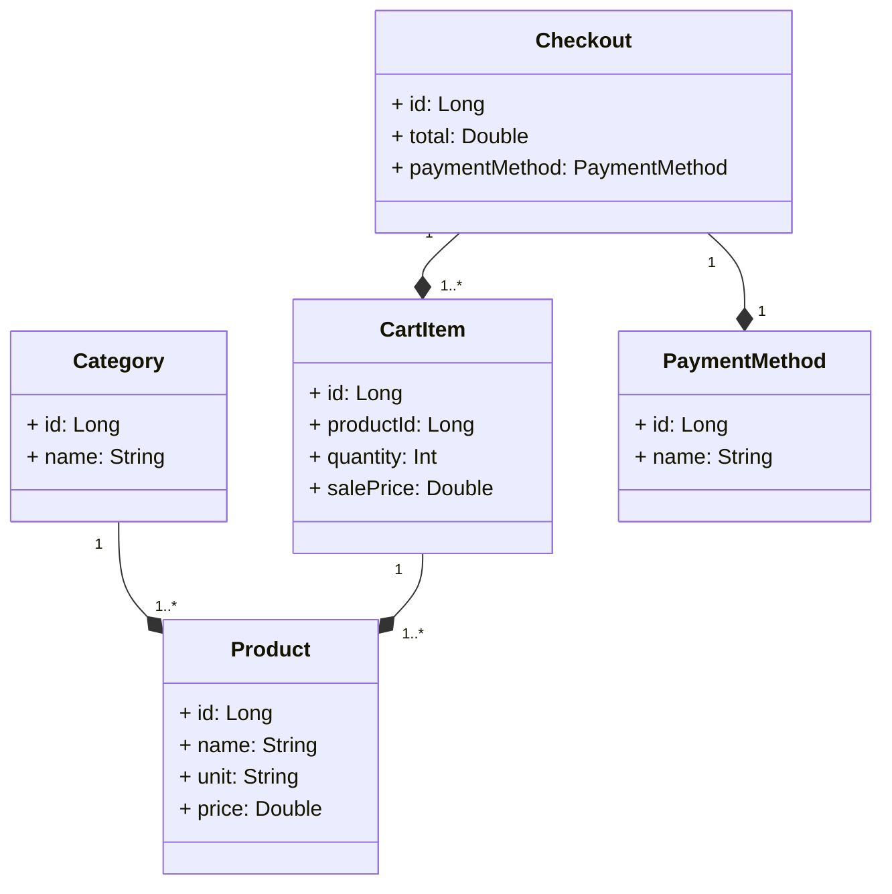

# Santander Dev Week 2023

Java RESTful API criada para a Santander Dev Week.

## Principais Tecnologias
 - **Java 17**: Utilizaremos a versão LTS mais recente do Java para tirar vantagem das últimas inovações que essa linguagem robusta e amplamente utilizada oferece;
 - **Spring Boot 3**: Trabalharemos com a mais nova versão do Spring Boot, que maximiza a produtividade do desenvolvedor por meio de sua poderosa premissa de autoconfiguração;
 - **Spring Data JPA**: Exploraremos como essa ferramenta pode simplificar nossa camada de acesso aos dados, facilitando a integração com bancos de dados SQL;
 - **OpenAPI (Swagger)**: Vamos criar uma documentação de API eficaz e fácil de entender usando a OpenAPI (Swagger), perfeitamente alinhada com a alta produtividade que o Spring Boot oferece;
 - **Railway**: facilita o deploy e monitoramento de nossas soluções na nuvem, além de oferecer diversos bancos de dados como serviço e pipelines de CI/CD.

## Diagrama de Classes (Domínio da API)

### Link documentação API em produção utilizando banco de dados relacional com PostgreSQL (Swagger)

A documentação da API do projeto de autoatendimento é gerada utilizando o Swagger, uma ferramenta amplamente utilizada para a documentação e visualização de APIs RESTful.

https://santander-autoatendimento-compras.up.railway.app/swagger-ui/index.html

# Funcionalidades

**1. Gerenciamento de Categorias:**
- Criar uma nova categoria.
- Obter informações de uma categoria existente por ID.
- Atualizar informações de uma categoria existente.
- Excluir uma categoria.

**2. Gerenciamento de Produtos:**
- Criar um novo produto associado a uma categoria específica.
- Obter informações de um produto existente por ID.
- Obter informações de todos os produtos disponíveis.
- Atualizar informações de um produto existente.
- Excluir um produto.

**3. Gerenciamento do Carrinho de Compras:**
- Adicionar um novo item ao carrinho de compras.
- Remover um item do carrinho de compras por ID do produto.
- Obter informações de um item no carrinho de compras por ID do produto.
- Obter informações de todos os itens no carrinho de compras.

**4. Finalização da Compra:**
- Finalizar uma compra, calculando o total de vendas com base nos itens do carrinho de compras.
- Atualizar o método de pagamento de uma compra existente.

## Configurações do Banco de Dados

O projeto utiliza o banco de dados H2 para testes e desenvolvimento e PostgreSQL para produção. Configurações a partir dos arquivos application-dev.yml e da application-prd.yml.

## Tratamento de Erros e Exceções
A aplicação possui um mecanismo de tratamento de erros para fornecer respostas adequadas em caso de problemas. Os erros são tratados de forma global no GlobalExceptionHandler, e diferentes tipos de exceções são mapeados para respostas HTTP com códigos de status apropriados.

## Considerações Finais do projeto "santander-auto-atendimento-de-compras"
Este projeto tem o funcionamento de um auto atendimento, permitindo que os clientes façam suas compras de forma autônoma e eficiente. 
A estrutura do projeto segue as melhores práticas de desenvolvimento em Java com o uso do Spring Framework, proporcionando modularidade, reutilização de código e facilidade de manutenção.

Para quaisquer dúvidas, problemas ou sugestões, por favor, abra uma "Issue" no repositório do GitHub.

### Contato:
<a href="https://www.linkedin.com/in/caiozamana/" target="_blank">
<a href="https://api.whatsapp.com/send?phone=55048991477921" target="_blank">

<table>
  <tr>
    <td>
      
    </td>
    <td align="left">
      <a href="https://github.com/caiobello">
        <b>Caio B. Zamana</b>
      </a>
       
      Desenvolvedor Full Stack
    </td>
  </tr>
</table>

<!--  -->
